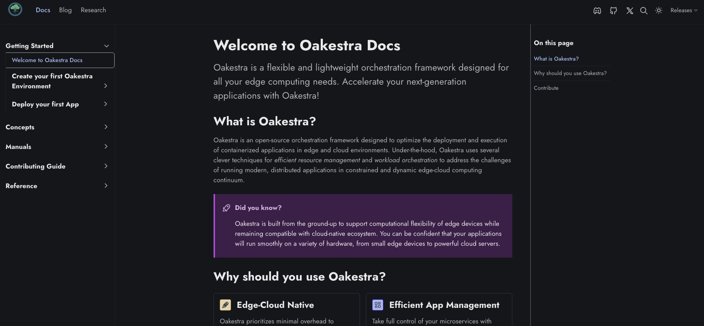
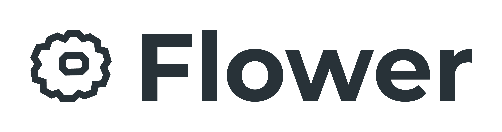
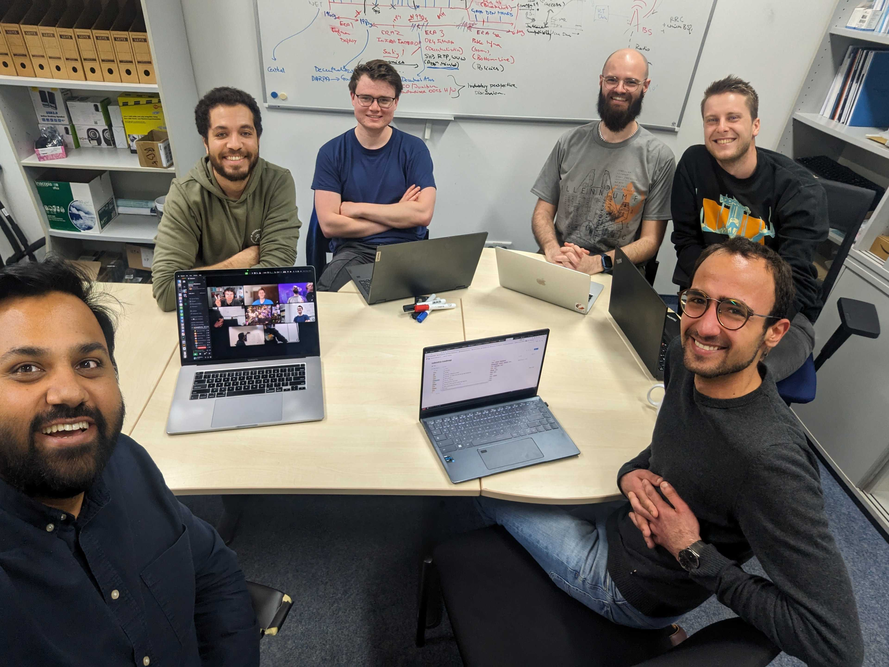
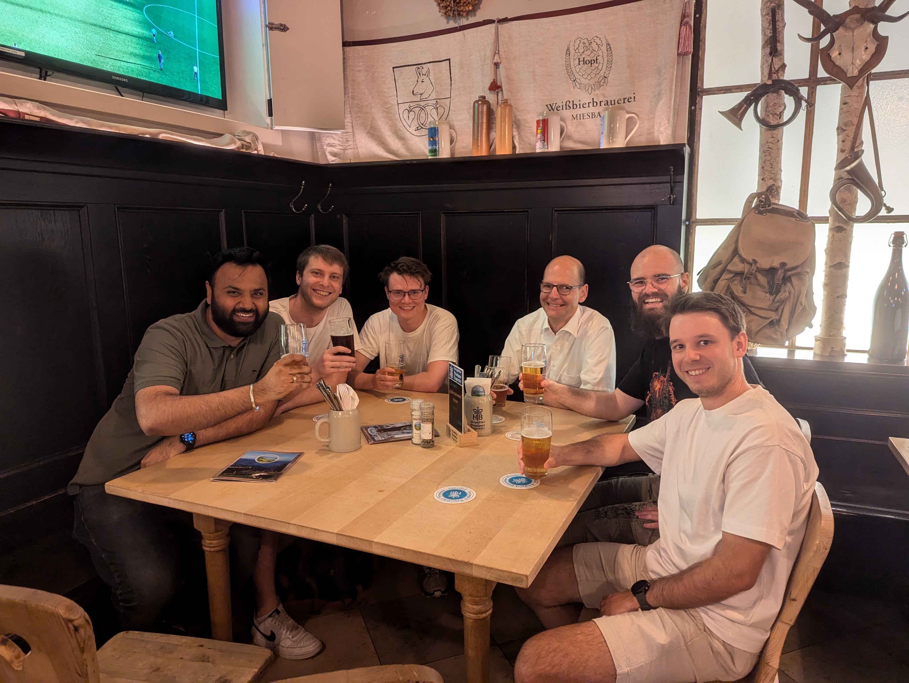

We are proud to announce that **Oakestra v0.4.4 (codename: Bass 🎸)** is here! *This is the second major release for Oakestra and it packs several goodies!*

Here are the new features introduced in this version!















## Modernized Documentation



Our completely overhauled documentation website is more than just a new look—it's a reimagined resource designed to guide you effortlessly through every aspect of Oakestra. Built on modern frameworks, the site adapts seamlessly to desktops, tablets, and smartphones. Whether you’re troubleshooting an issue or learning new features, you always have a smooth and intuitive experience. Every article has been refined for clarity and depth, making it the definitive guide for both beginners and seasoned developers.


Visit our revamped documentation [website](https://www.oakestra.io/docs/getting-started/welcome-to-oakestra-docs/) and share your feedback by submitting an issue [here](https://github.com/oakestra/documentation/issues/new?template=Blank+issue).


## Developer-Friendly Command Line Interface

Oakestra now includes its own [public CLI tool](https://github.com/oakestra/oakestra-cli) called `oak-cli`. It is a significant game-changer that makes life easier for Oakestra users and developers. The `oak-cli` includes powerful dynamic and customizable features to automate every aspect of your Oakestra workflows, including installing dependencies, deploying applications and services, inspecting service logs in real time, and much more.


The `oak-cli` is just getting started. We envision that the `oak-cli` will become the primary interface for working with Oakestra soon, so we encourage you to start using it straight away.

To download it, simply run

```bash
pip install oak-cli
```


Learn how to use the `oak-cli` to create your first Oakestra application [here](https://www.oakestra.io/docs/getting-started/deploy-app/with-the-cli/) and explore every available command [here](https://www.oakestra.io/docs/manuals/cli/cli-overview/).


## Federated Learning Support

Embracing the future of machine learning, our new FLOps addon introduces robust federated learning capabilities into Oakestra. Wondering *"What is Federated Learning?"* —check out our [brief explanation](https://www.oakestra.io/docs/concepts/flops/fl-basics/).



This addon automatically augments your standard machine learning code into FL-compatible, multi-platform container images and deploys them onto orchestrated worker nodes for training. Users can monitor training rounds live via a sophisticated GUI, then pull the trained model or let FLOps build and deploy an inference server. FLOps supports both classical and clustered hierarchical federated learning, leveraging tools like [Flower](https://flower.ai/), [mlflow](https://mlflow.org/), and [Buildah](https://buildah.io/).

<div style="display: flex; justify-content: center;">
  
    
    
</div>


Find out more in our dedicated [FLOps documentation](https://www.oakestra.io/docs/concepts/flops/overview/#fl-with-oakestra).


## Oakestra Addons

Addons in the Bass release let developers extend or customize Oakestra's components. With this release, you can install plugins or extensions in your Root Orchestrator. A **Plugin** replaces an Oakestra component with a custom one (e.g., replacing the root scheduler), while an **Extension** deploys a new custom component alongside the existing control plane.


Extend Oakestra functionality by defining your own addons. Learn more in our [detailed guide](https://www.oakestra.io/docs/concepts/oakestra-extensions/addons/).


## Lifecycle Hooks

With the Bass release, Oakestra introduces lifecycle hooks. Hooks allow developers to register, listen to, and react on lifecycle events of your applications. We now support *Creation*, *Update*, and *Deletion* hooks. Synchronous hooks block operations until a response is received, while asynchronous hooks notify subscribers without delay.



For example, you can register an asynchronous `post_update` hook to trigger alerts when an application’s state changes, or a synchronous `pre_update` hook to update the service status with your custom logic.


For more details, visit our [wiki](https://www.oakestra.io/docs/concepts/oakestra-extensions/hooks/).


## Priviledged Containers

For advanced use cases requiring elevated system access, the new privileged containers feature is a game changer. By setting the `"privileged": true` flag in your SLA microservice description, you can deploy containers with full system privileges—ideal for scenarios demanding direct hardware access or specialized kernel operations. This feature remains securely disabled by default and is enabled only when explicitly needed.


Privileged containers unlock enhanced functionality but must be used with care due to their elevated permissions. 


## Fixes and Improvements

- Upgraded MongoDB version
- Improved startup and installation scripts
- Fixed cluster direct mapping constraints issues
- Added systemd compatibility for NodeEngine and NetManager
- Introduced Mosquitto broker authentication options


Read our [release notes](https://github.com/oakestra/oakestra/releases/tag/v0.4.400) for further details. Or simply [get started](https://www.oakestra.io/docs/getting-started/oak-environment/high-level-setup-overview/) with your new Oakestra setup following our detailed guide!


## Community Activites

### Celebrate Christmas in Style with Oakestra-Powered Edge Gaming

On Christmas 🎄, we inaugurated the Bass release with an Edge Gaming deployment of Minecraft. We deployed the Minecraft web client, proxy, and server on Oakestra and enjoyed a multiplayer session right in our browsers!

<p float="center">
  
  
</p>


Instructions to replicate this deployment is available [here](https://www.oakestra.io/docs/manuals/app-catalog/example-applications/).


### Oakestra Becomes Social on X and YouTube

We’re expanding our social media presence—join us on X (formerly Twitter) and subscribe to our YouTube channel for live discussions, tutorials, and behind-the-scenes insights. We kicked off our community talk series with Luca Marchiori from the University of Padua, who shared details of his WebAssembly runtime support contributions to Oakestra.

<div style="display: flex; justify-content: center;">
<iframe style="aspect-ratio: 16 / 9; width: 100% !important;" src="https://www.youtube.com/embed/NN6V2ItLWSI" title="Oakestra Community Talk | WebAssembly meets Oakestra - Luca Marchiori" frameborder="0" allow="accelerometer; autoplay; clipboard-write; encrypted-media; gyroscope; picture-in-picture; web-share" referrerpolicy="strict-origin-when-cross-origin" allowfullscreen></iframe>
</div>






### Oakestra Developer and Maintainer Meetups

The Oakestra community continues to grow with in-person meetups, hackathons, and social gatherings.  
  


Oakestra was also present at the Oktoberfest in Munich 🍻:



We are incredibly excited about the opportunities the Bass release unlocks for developers and end users alike. Whether you’re a veteran in edge computing or just starting out, this update is designed to simplify complexity and inspire innovative solutions.

Happy orchestrating! 🌳💻