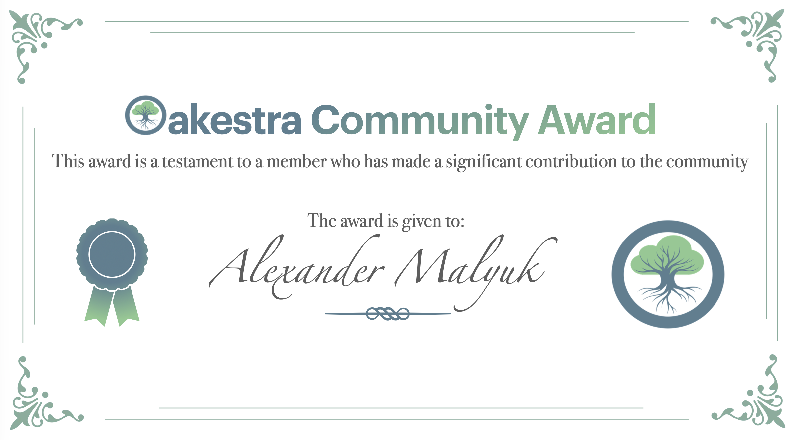
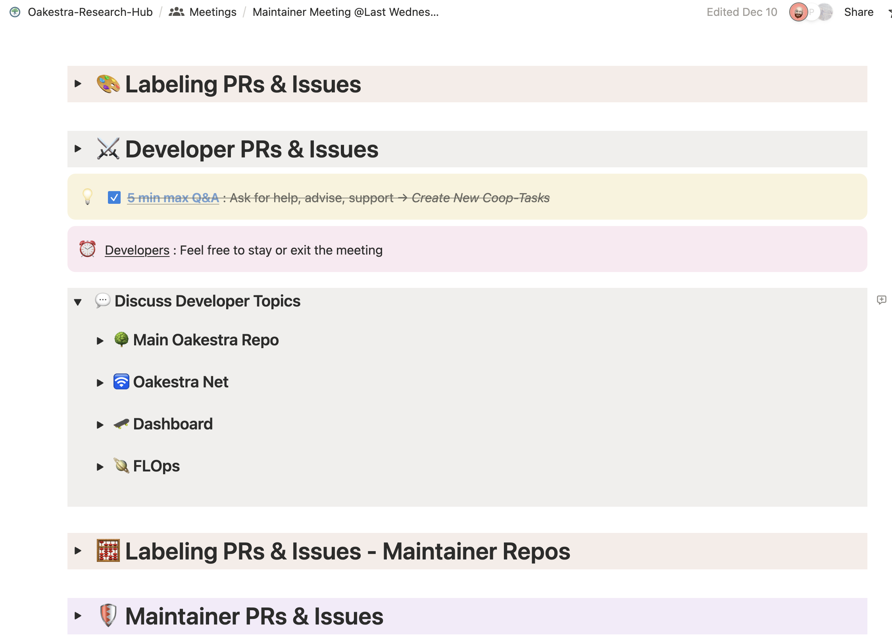

Oakestra is not only a research effort and an open-source project, but it is also growing strong as a community.

We are proud of the passion, respect, and insights shared weekly during our maintainers' meetings, and daily in our issues and PRs. This project is not just a canvas of ideas for edge computing, but it has grown into a place where everyone feels empowered and free to share their opinions. We believe we should not take this for granted.

Therefore, let's take a moment to congratulate all the amazing contributors to this project:

> [Luca G. Pinta](https://github.com/TheDarkPyotr),
> [Mahmoud ElKodary](https://github.com/melkodary),
> [Ben Julian Riegel](https://github.com/MrSarius),
> [Tomas Agata](https://github.com/tomasagata),
> [Patrick Sabanic](https://github.com/sabtf),
> [Oliver Halu](https://github.com/oliverhalu),
> [Jackob Kempter](https://github.com/JakobKe),
> [Ivo Raimondi](https://github.com/HMF2475),
> [Alexander Malyuk](https://github.com/Malyuk-A),
> [Simon Zelenski](https://github.com/smnzlnsk),
> [Mehdi Yosofie](https://github.com/meeeehdiiii),
> [Daniel Mair](https://github.com/danimair9),
> [Philipp Kleber](https://github.com/axiphi),
> [Matthew Humphreys](https://github.com/Mjaethers),
> [Giovanni Bartolomeo](https://github.com/giobart),
> [Jörg Ott](),
> [Nitinder Mohan](https://github.com/nitindermohan)

# Our very first community award 🥇

This year, for the very first time, we also wanted to celebrate someone who has distinguished themselves from an already amazing team of people. In particular, we want to show a small token of appreciation to a person who has substantially impacted the community with their ideas.

### Thank you [Alexander Malyuk](https://github.com/Malyuk-A) for your incredible contribution to the Oakestra Community 🎉

We decided to give this recognition to [Alex](https://github.com/Malyuk-A) for his continuous effort in providing valuable insights and suggestions. He also radically changed the way weekly meetings are organized, and brought countless quality of life improvements.

Do you like the way this Notion page is organized? Do you like the way weekly meetings are managed? That's all on him! 👏

During his award recognition message, he said:

> "My request to every single one of you is to pick just one person — someone you know, a contributor to an OSS project you like, or an indie artist you enjoy — and simply write to them or give them a call. Let them know they are appreciated." - Alex

Let’s treasure these sentiments, and in the spirit of the holidays, take a moment to recognize the people around us.

### Happy holidays everyone! 🎄
