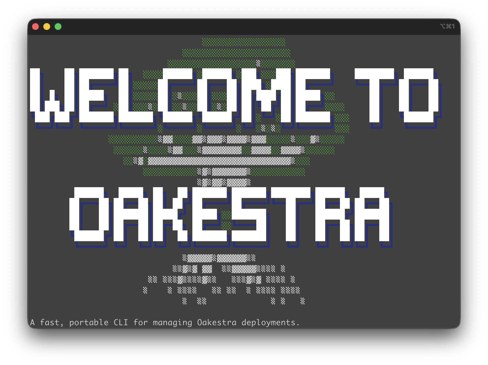
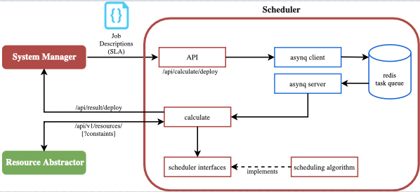
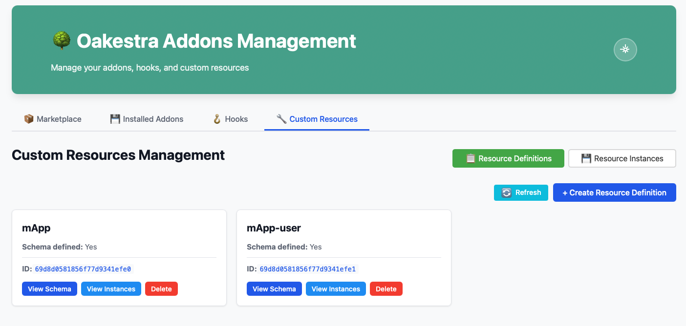
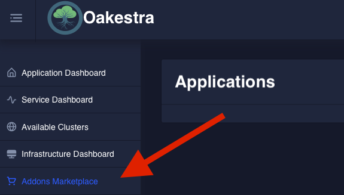
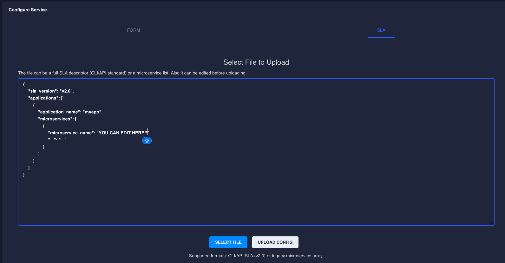

We are proud to announce that Oakestra Conga 🪘 (v0.4.410) is here! *This is the third major release of Oakestra and the rhythm of the new features will have you dancing!*















# New CLI

The CLI is now the default way to install and interact with your Oakestra installation. The new CLI is a simple binary that gets installed with a single command: `curl -sfL oakestra.io/oak.sh | bash`

From here you can:

- 📀 Manage your Oakestra components installation
- 📡 Check your cluster status
- 📲 Create and remove applications
- 📈 Create, scale, remove services
- 📊 Monitor deployment status and service information (such as deployment failures, logs, resource usage, and more!)
- 🤖 You can even use Claude AI to solve your Oakestra setup problems

### Check how `oak doctor` can verify your installation





You can use Claude AI 🤖 to help you troubleshooting your infrastructure!

- Configure the Claude Oakestra Doctor skill using `oak config claude`
- Then use `oak doctor <component>` command with the `--ai-troubleshoot` flag and let Claude handle the rest.

Check out the troubleshooting [wiki](/docs/manuals/troubleshooting-guide/).

 

# New Installation Procedure

Thanks to the new CLI, installing Oakestra has never been easier! Check this out ⬇︎



Check out the [installation wiki](../../docs/getting-started/oak-environment/create-a-single-node-cluster/) for a quick installation and the [advanced setup guide](../../docs/getting-started/oak-environment/advanced-cluster-setup/) to unleash the full potential of Oakestra.

# Storage Drivers

This release brings support for [CSI](https://github.com/container-storage-interface/spec/tree/master) Storage plugins! Volumes management at the edge is not an easy task, and with CSI plugins you can now attach storage drivers customized for your needs. Check out the [CSI Plugin Wiki](../../docs/getting-started/oak-environment/advanced-cluster-setup/).

# Service Scheduling Redefined

Oakestra Conga introduces a redefined concept for task scheduling. Resources and aggregation strategies are now fully generalized, making schedulers swappable across root and cluster components.

If you're doing research on task scheduling, you can now customize, implement and replace scheduling strategies at the root and cluster level with minimal effort!

Check out the new [Resource Management wiki](/docs/concepts/resource-management/#canonical-resources) to find out how scheduling and resource management have changed. If you want to implement a new scheduler for Oakestra, check out the [scheduler component README](https://github.com/oakestra/oakestra/tree/develop/scheduler).

# A New Look for Your Addons

The new addons dashboard allows you to easily manage:

- [Addons](/docs/manuals/extending-oakestra/installing-addons/) by connecting to your local marketplace instance and installing your preferred ones.
- [Hooks](/docs/manuals/extending-oakestra/setting-up-hooks/) via a dedicated UI interface.
- [Custom Resources](/docs/manuals/extending-oakestra/creating-custom-resources/) for both creation and management operations.

If the marketplace dashboard is reachable from your network, a link will appear in your Oakestra Dashboard!

# Cross VM Compatibility

Oakestra Conga now enables seamless workloads across different virtual machine environments, providing greater flexibility for edge deployments.

# Dashboard Deployment Descriptor

The SLA uploader in the dashboard now supports in-line editing.

Additionally, you can provide the same SLAs as your CLI and APIs, provided that the application name and namespace match the application you're providing the SLA for.

# A Step Closer to a Production Release

This release introduces plenty of under-the-hood improvements for system stability, bringing the platform one step closer to production readiness. You can check the full changelog [here](https://github.com/oakestra/oakestra/releases/tag/alpha-v0.4.410).

Get in touch with us and help us grow stronger. We've got plenty of open issues and exciting problems to work on.



  
  



#### Acknowledgments:

Many thanks to the contributors for this release:

- [@Mjaethers](https://github.com/Mjaethers)
- [@axiphi](https://github.com/axiphi)
- [@HMF2475](https://github.com/HMF2475)
- [@melkodary](https://github.com/melkodary)
- [@smnzlnsk](https://github.com/smnzlnsk)
- [@giobart](https://github.com/giobart)
- [@nitindermohan](https://github.com/nitindermohan)
