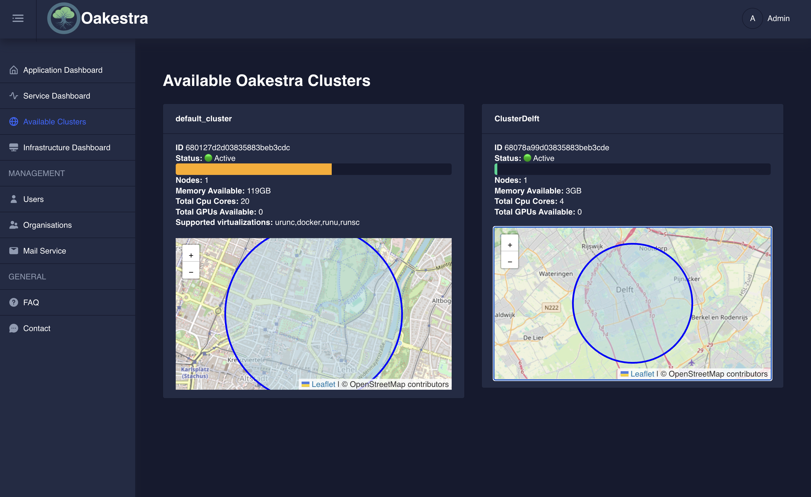

We are thrilled to announce the release of Oakestra Dashboard v0.4.207, bringing enhancements designed to provide you with greater insight and control over your distributed computing environment. This latest update focuses on improving resource monitoring and streamlining essential management tasks, empowering you to optimize your Oakestra clusters with unprecedented clarity.

## A Clearer Picture: Introducing the New Available Clusters Section

The cornerstone of this release is the brand-new "Available Clusters" section, a direct response to your feedback for more comprehensive visibility into your Oakestra deployments. As seen in the attached image, this dedicated section provides a centralized view of all your active clusters, offering crucial information at a glance:

- **Real-time Resource Monitoring**: For each cluster, you can now instantly see the number of active Nodes, the total Memory Available, and the aggregate Total CPU Cores. This immediate overview is invaluable for understanding your current resource allocation and identifying potential bottlenecks or underutilized capacity.
- **Status at a Glance**: The "Status" indicator (e.g., "Active") provides a quick health check of each cluster, allowing you to rapidly identify any operational issues.
- **Geographical Context**: The inclusion of interactive maps for each cluster is a game-changer. This visual representation of your cluster's location is critical for distributed deployments, enabling you to understand latency implications, optimize service placement, and manage geographically dispersed resources more effectively.
- **Supported Virtualizations**: Knowing the "Supported virtualizations" (e.g., `urunc`, `docker`, `runu`, `runsc`) for each cluster helps you ensure compatibility and plan your application deployments accordingly.

This new section transforms how you monitor your available resources. It's no longer just about knowing what resources you have, but where they are, how they're performing, and what their current status is. This holistic view is essential for informed decision-making, proactive resource management, and ultimately, maximizing the efficiency and reliability of your Oakestra infrastructure.


What are you waiting for? Try out the new dashboard and deploy the latest Oakestra release now! [Read our getting started guide](/docs/getting-started/oak-environment/create-your-first-oakestra-orchestrator/)


## Under the Hood: Bug Fixes and Performance Improvements

Beyond the exciting new cluster view, `v0.4.207` also delivers a series of important bug fixes and general improvements, further enhancing the stability and usability of the Oakestra Dashboard. We've paid particular attention to:

- **Account Management**: We've addressed some of the issues you may have encountered when managing your user accounts and passwords.
- **Application Selection**: Fixes for the application selection process in the service management panel. Ensuring a more seamless and reliable experience when deploying and managing your services across different applications.

These refinements, while perhaps less visually prominent, contribute significantly to a more robust and enjoyable user experience, making your daily interactions with the dashboard more efficient and error-free.

## Looking Ahead

Oakestra Dashboard v0.4.207 is a testament to our ongoing commitment to providing you with a powerful and user-friendly platform for managing your distributed infrastructure. The new "Available Clusters" section marks a leap forward in resource visibility, offering unprecedented insight into your deployments. We encourage you to explore these new features and experience the enhanced control they offer.


We welcome your feedback as we continue to evolve the Oakestra platform. Stay tuned for more exciting updates in the future!
