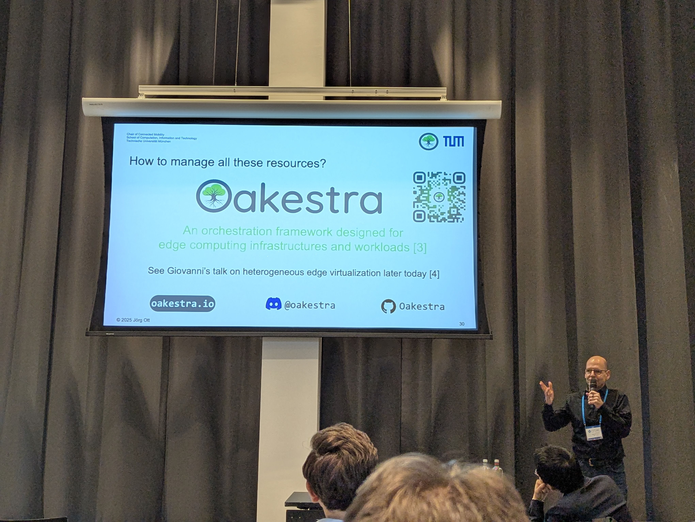
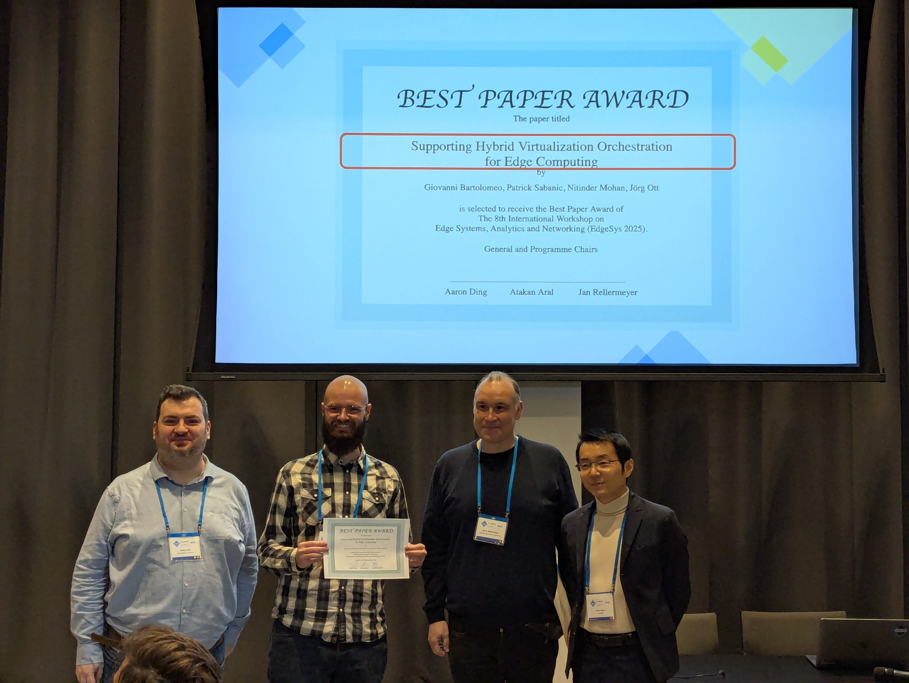
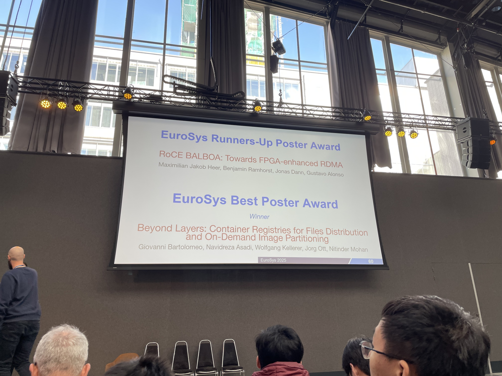
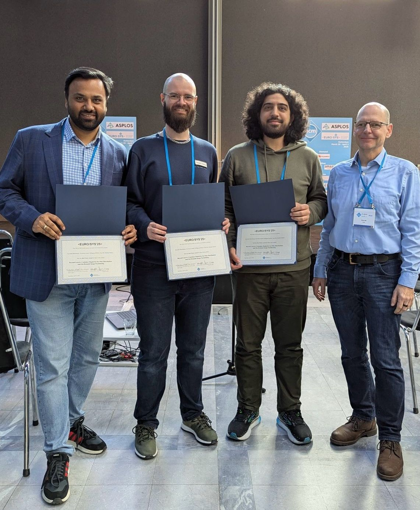

Oakestra has truly made its mark at **ACM EuroSys + ASPLOS 2025**—the largest and most prestigious scientific conference in systems research. Held in Rotterdam, Netherlands, this top-tier event attracted over **1200 attendees**, uniting the best minds and innovations in edge computing and beyond.







## ACM EdgeSys 2025 Keynote: "The Edge is Near"

At ACM EdgeSys 2025, **Prof. Dr. Jörg Ott** delivered the keynote talk, **"The Edge is Near"**, emphasizing that the core challenges in edge computing come down to effective orchestration. His insights highlighted that solutions like Oakestra are best suited to alleviate these challenges and drive the future of connected edge systems.

## Best Paper Award: "Supporting Hybrid Virtualization Orchestration for Edge Computing"

Oakestra's innovative research shined bright when its paper, **"Supporting Hybrid Virtualization Orchestration for Edge Computing"**, won the Best Paper Award at ACM EdgeSys 2025. This work demonstrates Oakestra’s integral solution in supporting both Unikraft unikernel and container virtualization -- a capability that has been part of Oakestra since the [Accordion release](/blog/oakestra-releases-v0.4.301-accordion/).

  

    
  

  

    
  


Do you also want to leverage Unikraft unikernel and container virtualization in your edge computing environment? [Read our detailed guide](/docs/manuals/execution-runtimes/unikernel-deployment/)!


## Best Poster Award at ACM EuroSys 2025

In the ACM EuroSys 2025 main conference program, the Oakestra team presented an innovative poster/demo its upcoming OCI-compatible TDFS packaging solution. Their poster showcased an innovative solution for accelerating the packaging and deployment of machine learning models on heterogeneous edge devices.



The team clinched the **Best Poster Award at ACM EuroSys 2025**. 

  

    
  

  

    
  


Keep your eyes peeled for the upcoming official support in Oakestra to fully maximize the AI potential of your edge systems.


## A Celebration of Scientific Excellence

The awards and recognitions at ACM EuroSys + ASPLOS 2025 underscore the scientific advancements deeply rooted in Oakestra technology. These successes not only highlight Oakestra's innovation in edge computing orchestration but also reinforce our commitment to pushing the boundaries of systems research.

