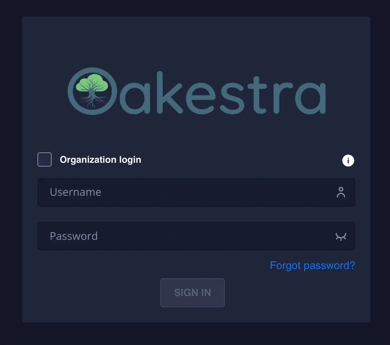
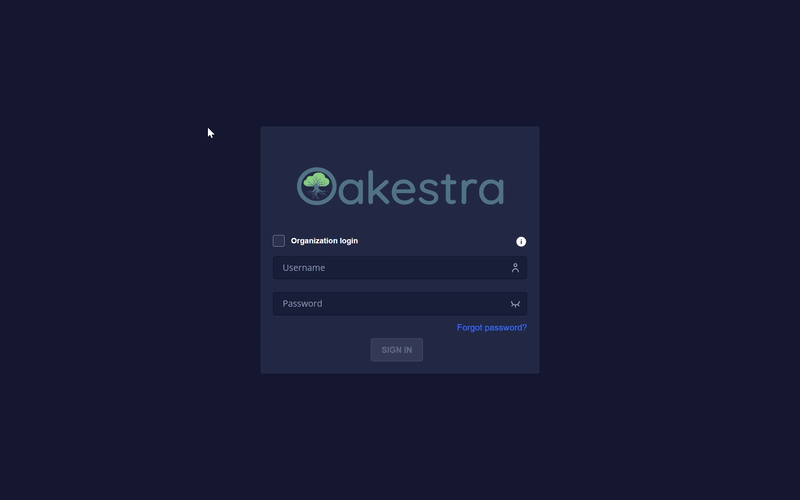
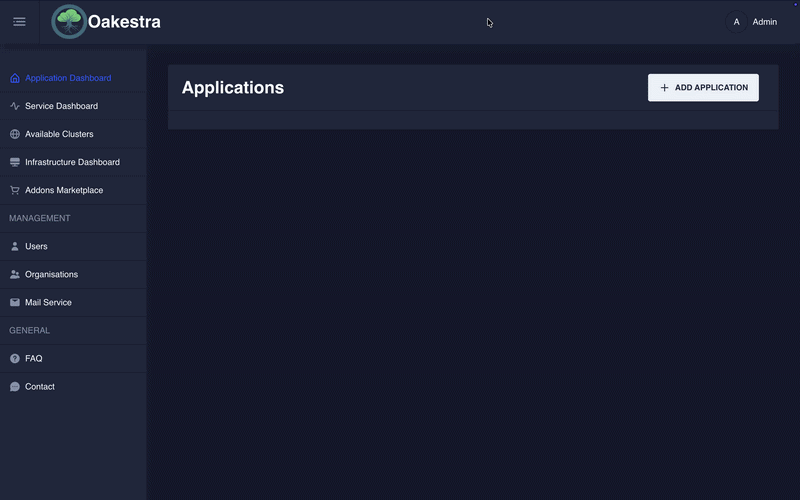
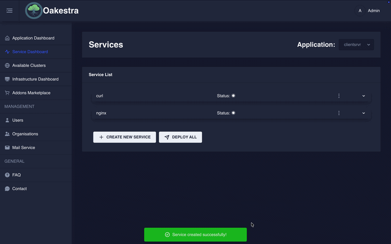
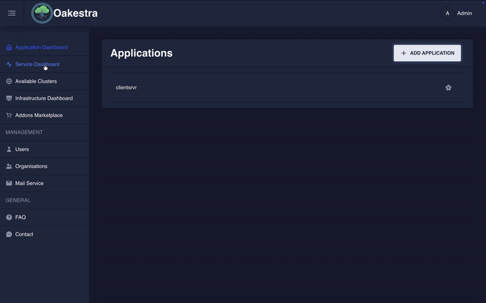
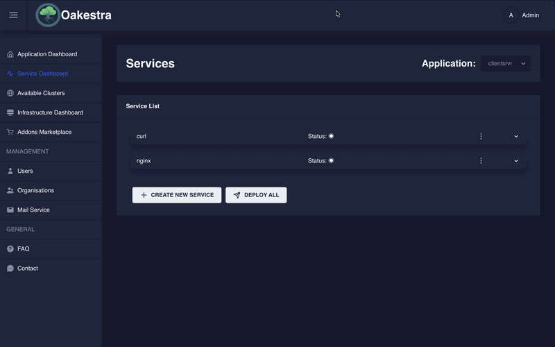
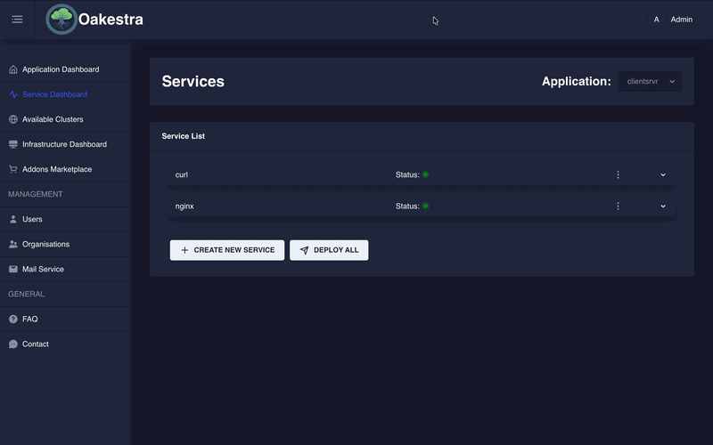

<span class="lead">
You can also manage your infrastructure and deploy/monitor applications using the Oakestra frontend dashboard.
</span>


- View the applications currently running on the cluster.
- Create and modify individual services.
- Check the status of running services.
- Configure service-level agreements (SLAs).
- Check the status and location of your clusters.
- Create/manage users and organizations.



## Deployment


- You have a running Oakestra setup (Root and Cluster Orchestrator).
- You can access the APIs at `<IP_OF_CLUSTER_ORCHESTRATOR>:10000`.



When you start Oakestra using the standard installation scripts (as described in the [Create Your First Oakestra Orchestrator](../../oak-environment/create-your-first-oakestra-orchestrator/) section), **the dashboard is automatically deployed along with the other Oakestra components**.

You don't need to perform any additional steps to deploy the dashboard.

## Accessing the Dashboard

Once Oakestra is running, you can access the dashboard at:

```bash
http://<IP_OF_ROOT_ORCHESTRATOR>
```

Replace `<IP_OF_ROOT_ORCHESTRATOR>` with the IP address of the machine hosting your Root Orchestrator.


If the Oakestra components are not running or configured correctly, you can reach the login screen but will not be able to log in.


## Using the Dashboard




Upon launching the system for the first time, an administrative user is automatically created.
This user can create and manage other users and organizations within the system. More on [User Management](../../../manuals/dashboard-features/organizations/#user-management) later.



> Username: `Admin`\
> Password: `Admin`

**After setting up the cluster manager, immediately change the password of the admin user!**





#### (Optional) Organization Login

To log in to an organization, check the *Organization login* box and enter the organization name. If the box is not checked or the organization
name is left empty, then you will be logged in to the default root organization.



Here you can see the login to the *sampleOrga* organization.





In Oakestra, there are applications, services, and namespaces. One application can encompass multiple services, and one user can create
multiple applications on one system. Namespaces allow you to create applications and services with the same name in different namespaces,
e.g., `production` and `development`.

First, you will have to create an application. Choose a concise name, the namespace, and optionally a description.







If you used the [CLI](../with-the-cli) you are already familiar with the SLAs.
While the dashboard still allows you to upload SLAs as a JSON file, it also provides you with an interactive form.

Once you have created an application you can create services. Once again you will have to choose a concise name, a namespace and optionally a description.
However this is far from it; system requirements, environmental variables, connection details and much more can be specified here.

You will have to choose a virtualization method (Container or Unikernel) and tell Oakestra where it can find your code.
Hit save and your service is ready for deployment!















After you registered your services, you can start a deployment. This operations uses the Root and Cluser schedulers to install the application in one of your worker nodes.
You can eihter click "Deploy All" to deploy all the services in your application. Or you can use the service drop down menu to deploy a single instance of a specific service.








Once a service has been created and deployed, you can check on it's status and other details. Choose a service from the *Service List* and from the drop-down
menu, choose an instance and click on *View Instance Details*.








If you have any new feature ideas or if you find any bugs please open an issue in the [GitHub repository](https://github.com/oakestra/dashboard).

