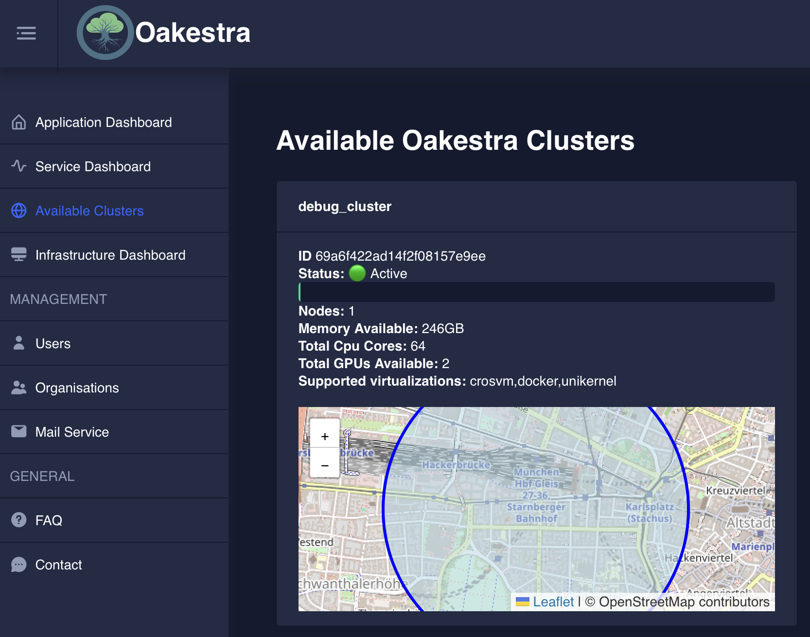

In this wiki we'll help you check if your Oakestra installation is up and running as you expected.

## Check your clusters status
This is how you can check your clusters' status.



Simply run:
```bash
oak cluster ls
```


Did you know? You can install the Oakestra CLI on any machine and manage your Oakestra cluster remotely. Check [our CLI wiki](../../getting-started/deploy-app/with-the-cli/).



Reach your Oakestra Dashboard at `http://<ROOT_ORCHESTRATOR_IP>`, log in and click the *Available Clusters* section.






Either directly perform a `GET` request to: `http://<ROOT_ORCHESTRATOR_IP>:10000/api/clusters`

Or use the Swagger API documentation available at `http://<ROOT_ORCHESTRATOR_IP>:10000/api/docs`







Check out [addons](../extending-oakestra/creating-addons) for the Oakestra customization options!




## Check the installed components

You can check the status of your Oakestra components as follows:



In the root orchestrator machine, run:

```bash
oak doctor root
```

This will show you if all components are running correctly.


In each cluster, the orchestrator machine runs

```bash
oak doctor cluster
```

This will show you if all components are running correctly.


In each worker node machine, run

```bash
oak doctor worker
```

This will show you if the NodeEngine and NetManager components, the living soul of your worker node, are up and running as expected.





If something is not working, please check out our [Troubleshooting Guide](../../../manuals/troubleshooting-guide).

