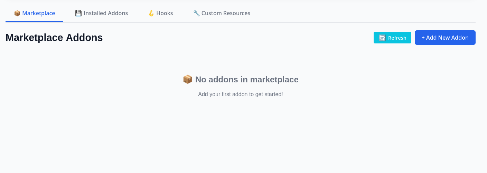

<span class="lead">
To install an addon, it first has to be published to the marketplace. Addons are published as a Dockerfile
containing the addon functionality and a configuration file outlining the addons specifications.
</span>



Currently there isn't a global marketplace for addons. Keep an eye our for this in future releases!




### Dockerize the Addon
Package your code into a Docker image by creating a `Dockerfile` such as:
```dockerfile
FROM python:3.9-alpine

RUN pip install -r requirements.txt
COPY . /addon

ENTRYPOINT ["python", "/addon/main.py"]
```

Build and push the Docker image to a container registry, such as [Docker Hub](https://hub.docker.com/):
```bash
docker build -t your-username/addon-name:latest .
docker push your-username/addon-name:latest
```

### Publish the Addon to the Marketplace
Define the addon configuration according to the following template:
```json
{
  "name": "addon-name",
  "networks": [],
  "volumes": [{
    "name": "myvolume",
    "driver": "bridge"
  }],
  "services": [{
    "image": "your-username/addon-name:latest",
    "service_name": "my_service",
    "networks": [],
    "volumes": ["myvolume:/somevolume"],
    "ports": {"10007":"10007"}
  }]
}
```
Where:
- **name**: Identifies the addon
- **services**: Defines the service(s) required by the addon.
- **volumes/networks**: Specifies optional configurations for data persistence or connectivity.

To make the addon available for other in the Oakestra ecosystem, publish it to the addons marketplace by selecting "Add New Addon" and then filling out the form. Alternatively you can paste the raw JSON document.



The addons marketplace will validate the descriptor. Once approved, the addon will be marked as `approved` and become available for installation.


Publish an addon by sending a `POST` request with the JSON descriptor to the addons marketplace API `/api/v1/marketplace/addons`.



To create a service that would replace a component inside Oakestra (i.e. a [Plugin](../../../concepts/oakestra-extensions/addons)), the service name should match the name of that component. 

For instance, to replace the scheduling component at the cluster the service would have to be called by its exact name `cluster_scheduler`.
Note the difference between a service and an addon, is that an **addon may contain multiple services**.


