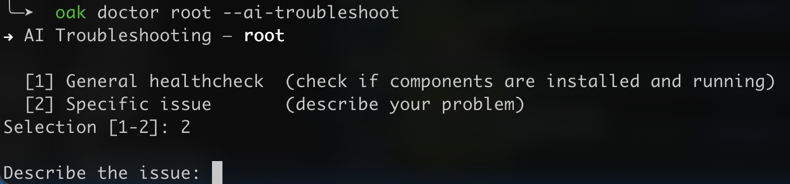

In this page you will find a set of steps to troubleshoot and hopefully fix your Oakestra setup.

# Where to start:

On each machine where you installed oakestra you can run:
```bash
oak doctor <component>
```

where **<component>** can be either: `root` for Root Orchestrator, `cluster` for Cluster Orchestrator, `worker`for the Worker Node or `all` if all the components are installed in the current machine.

E.g.: `oak doctor root`

With such command, you can either check the status of the root, cluster or worker node components.

# What to do next?





You can use Claude AI to pinpoint your problem and help you fix your innfrastructure configuration

First you need to install Claude CLI. Then you can run
```bash
oak config claude
```
This command installs the **Oakestra Teoubleshooting Skill** in your Claude CLI.

Then you can use:

```bash
oak doctor <component> --ai-troubleshoot
```



You can either perform a general check or describe a specific issue.

<div style="background:#FAE251;padding-top:3px;padding-bottom:3px;padding-right:3px;padding-left:3px">
<h3> Be Carefull 💸 </h3>

Oak doctor with the `-ai-troubleshoot` flag uses Claude CLI. It requires either an active subscription or a payment method configured for your token consumptions. Check the pricing <a href=https://claude.com/pricing>here</a>.
</div>

### You don't like Claude? Use your preferred AI instead
If you want to use your own AI agent to help you troubleshoot your Oakestra deployment, you can request assistence to you agent by manually installing the [troubleshoot oakestra skill](https://raw.githubusercontent.com/oakestra/oakestra/refs/heads/develop/SKILLS/troubleshoot-oakestra.md).





Here a quick reference of the commands you can run to manually troubleshoot your Oakestra installation.

## 0. Identify what's running

```bash
docker ps --format "table {{.Names}}\t{{.Status}}\t{{.Ports}}"
```

- `system_manager`, `mongo`, `root_scheduler` → **Root Orchestrator**
- `cluster_manager`, `mqtt`, `cluster_scheduler` → **Cluster Orchestrator**
- `NodeEngine` binary/service → **Worker Node**

---

## 1. Are all containers up?

```bash
docker ps -a --format "table {{.Names}}\t{{.Status}}"
```

**Root** expects: `system_manager`, `mongo`, `mongo_net`, `root_service_manager`, `root_redis`, `root_scheduler`, `root_resource_abstractor`, `jwt_generator`, `grafana`, `loki`, `promtail`, `oakestra-frontend-container`

**Cluster** expects: `mqtt`, `cluster_mongo`, `cluster_mongo_net`, `cluster_service_manager`, `cluster_manager`, `cluster_scheduler`, `cluster_resource_abstractor`, `cluster_redis`, `prometheus`, `cluster_grafana`, `cluster_loki`, `cluster_promtail`

If a container is `Exited` or `Restarting`, read its logs immediately:
```bash
docker logs --tail 100 <container_name> 2>&1
```

---

## 2. Common errors and quick fixes

| Symptom | Likely cause | Fix |
|---|---|---|
| Container keeps restarting | Dependency (DB/Redis) not ready | `docker restart <container>` after deps are healthy |
| `Connection refused` to mongo/redis | Wrong URL env var or DB not ready | Check env vars; restart affected container |
| `no such host` | Host-network mode: DNS names don't work | Use IPs, not container names in env vars |
| `JWT` errors in system_manager | `jwt_generator` not started | `docker restart jwt_generator` |
| Cluster not registering with root | Wrong `SYSTEM_MANAGER_URL` (using `localhost`) | Use the root machine's real IP, not `localhost` |
| Jobs stuck in `CLUSTER_SCHEDULED` | Worker not acknowledged or MQTT down | Check worker logs and MQTT health |
| Worker can't connect to MQTT | Firewall blocking port 10003 | `sudo ufw allow 10003/tcp` on cluster machine |
| Port already in use | Another process on the port | `sudo ss -tlnp sport = :<port>`, then kill the PID |

---

## 3. Check critical env vars

```bash
# Is cluster_manager pointing at the real root IP?
docker exec cluster_manager env | grep SYSTEM_MANAGER_URL

# Are Redis addresses correct?
docker exec root_scheduler env | grep REDIS_ADDR        # should end in @root_redis:6379
docker exec cluster_scheduler env | grep REDIS_ADDR     # should end in @cluster_redis:6479
```

`SYSTEM_MANAGER_URL` must be the **root machine's real IP** — not `localhost` or `127.0.0.1` unless everything is on one machine.

---

## 4. Is Redis working?

```bash
docker exec root_redis    redis-cli -a rootRedis    ping
docker exec cluster_redis redis-cli -p 6479 -a clusterRedis ping
```

Check for stuck jobs:
```bash
docker exec root_redis    redis-cli -a rootRedis    llen "asynq:{schedule:job}:failed"
docker exec cluster_redis redis-cli -p 6479 -a clusterRedis llen "asynq:{schedule:job}:failed"
```

A non-zero `failed` count means the scheduler is rejecting jobs — check scheduler logs.

---

## 5. Is MQTT healthy? (Cluster)

```bash
docker inspect mqtt --format '{{.State.Health.Status}}'
docker logs mqtt 2>&1 | tail -30
```

An unhealthy MQTT blocks all worker communication.

---

## 6. Can the cluster reach root?

```bash
curl -s http://<ROOT_IP>:10000/api/v1/info
```

If this fails from the cluster machine, the firewall is blocking port 10000.

---

## 7. API smoke tests

```bash
curl -s http://localhost:10000/api/v1/info        # root system_manager
curl -s http://localhost:10004/status             # root_scheduler
curl -s http://localhost:11011/status             # root_resource_abstractor
curl -s http://localhost:10105/status             # cluster_scheduler
curl -s http://localhost:11012/status             # cluster_resource_abstractor
curl -s http://localhost:10011/status             # jwt_generator
```

---

## 8. Worker node issues

```bash
# Logs
tail -100 /var/log/oakestra/nodeengine.log
tail -100 /var/log/oakestra/netmanager.log

# Service status
systemctl status NodeEngine
systemctl status NetManager

# Can worker reach cluster?
nc -zv <CLUSTER_IP> 10003   # MQTT
nc -zv <CLUSTER_IP> 10100   # cluster_manager
nc -zv <CLUSTER_IP> 10110   # cluster_service_manager
```

---

## 9. Clean restart (last resort)

```bash
# Stop and remove all Oakestra containers
docker ps -a --format "{{.Names}}" \
  | grep -E "system_manager|mongo|root_|cluster_|jwt_|grafana|loki|promtail|mqtt|addons|marketplace|oakestra" \
  | xargs -r docker rm -f

# Then re-run the startup script with the correct IP
export SYSTEM_MANAGER_URL=<real_ip>
oak install root   # or cluster or full
```

---

## 10. Required open ports (multi-machine)

| Port | Used by | Direction |
|---|---|---|
| 10000 | Root API | Cluster → Root |
| 10099 | Root service manager | Cluster → Root |
| 10003 | MQTT | Worker → Cluster |
| 10100 | Cluster manager | Worker → Cluster |
| 10110 | Cluster service manager | Worker → Cluster |
| 80 | Dashboard | Browser → Root |

---




## Still stuck?

[Open an issue](https://github.com/oakestra/oakestra/issues) or ask in our [discord channel](https://discord.gg/7F8EhYCJDf) and include:
- Output of `docker ps -a`
- Logs of the failing container (`docker logs <name> 2>&1`)
- Your deployment type (1-DOC / multi-machine)
- OS, Docker version (`docker --version`, `docker compose version`)
- What you expected vs. what happened
