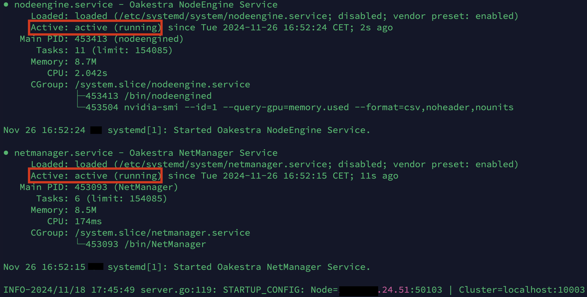

### Add a Worker Node to your Cluster

If you have a running **Root Orchestrator** and at least one **Cluster Orchestrator** you can add a new worker node to your cluster. 



First, you need to install your **Worker Node** components on every Edge Device you want to use as a worker running:

```bash
export OAKESTRA_VERSION=alpha-v0.4.403
curl -sfL oakestra.io/install-worker.sh | sh - 
```


Check out the system requirements for the **Worker Node** in the [System Requirements](../high-level-setup-overview) section.


Each worker node must be attached to a running **Cluster Orchestrator**. To do so, you need to know the IP address of the Cluster Orchestrator you want to connect to. 

 You can obtain the public IPv4 address of your device with

```bash
curl -4 https://ifconfig.co
```


Then, startup each **Worker Node** using the following command:

```bash
sudo NodeEngine -a <IP address of your cluster orchestrator> -d
```


the `-d` flag runs the NodeEngine in background (detached mode)


Check if your worker is running, and that it's correctly registered to your cluster:
```bash
sudo NodeEngine status
```

If everything is showing up green 🟢... Congratulations, your worker node is set up! 🎉




You can check the NodeEngine logs using 

```bash
sudo NodeEngine logs
```



If you run into a restricted network (e.g., on a cloud VM) you need to configure the firewall rules and the NetManager component accordingly. Please refer to: [Firewall Setup](../../../manuals/firewall-configuration)  


### Shutdown a Worker

To stop a worker node, use:

```bash
sudo NodeEngine stop
```

