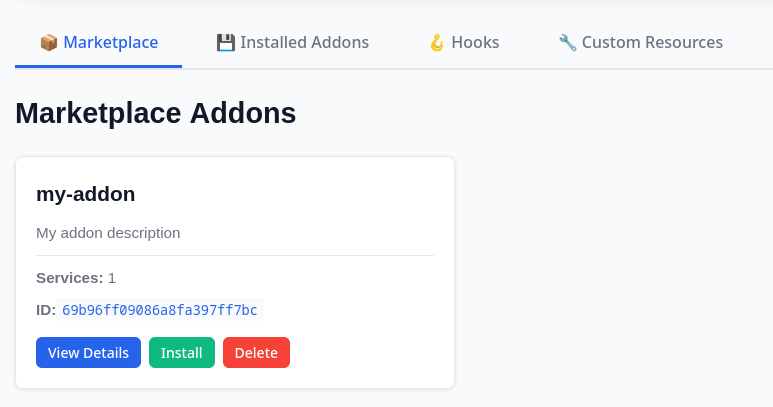
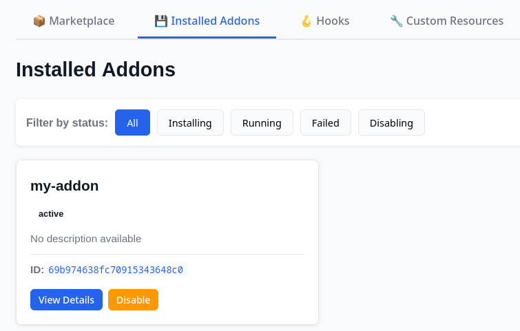
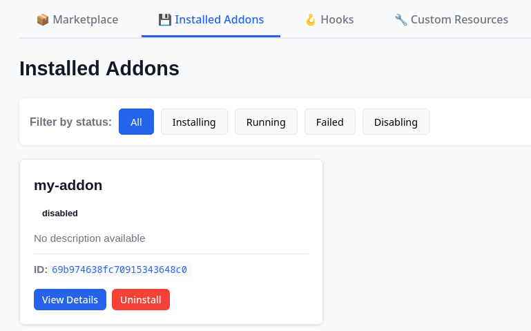

## Installation

You can view the available Marketplace Addons in the tab "Marketplace".



Installing an addon is as simple as pressing the button.


To install an addon, send a `POST` request to the addons engine - `/api/v1/addons`. The request body should have the following form:
```json
{
  "marketplace_id": "{addon_marketplace_id}"
}
```


## Verify Installation
The Addons Manager will:
- Retrieve the addon from the marketplace.
- Pull the Docker image associated with the addon.
- Deploy and integrate the addon into the Oakestra environment.

You can view the status of the addon in the "Installed Addons" tab.
While the addon is being pulled and started, it will show the status **installing**.

Once the addon is deployed it will switch to **active**




You can verify the installation by checking the addon’s status using the addons manager API - `[GET] /api/v1/addons/{addons_id}`



## Uninstall an Addon

To uninstall an addon, you must first disable it. One it has finished **disabling** you can select "Uninstall".




To uninstall an addon send a `DELETE` request to the addons manager - `/api/v1/addons/{addons_id}`



