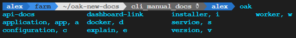

<span class="lead">
You can interact with you oakestra installation using any terminal on any machine you like.
</span>


  - You have a running Oakestra setup.



## The `oak-cli`



- Every machine where you installed at least one Oakestra component, already has the CLI installed.
- Native interface for the Oakestra APIs
  - Eliminates the need to use external third-party tools
- Accelerated & simpler workflows
  - Removes the need to memorize necessary API endpoints
  - The CLI commands can be chained together and used in custom scripts



## CLI Setup
**Any machine where you installed at least 1 Okaestra component already has the CLI installed.**
If you want to install the CLI on an external machine and manage your Oakestra deployment from there, follow these commands:



From your terminal, run:
```bash
curl -sfL oakestra.io/oak.sh | bash
```


From your terminal, run:
```bash
irm oakestra.io/oak.ps1 | iex
```



Execute `oak -h` and you will be welcomed into the Oakestra CLI world 🌎


Finally, you can configure the IP of your Oakestra Root Orhcestrator

```bash
oak config set root_orchestrator_address <IP OF YOUR ROOT ORCHESTRATOR>
```

For further information about the CLI configuration see the [CLI Configuration Manuals](/docs/manuals/cli/features/configuration).

### Deploying your first Application using the CLI

Deploying your first app with the CLI is simple. Oak CLI already provides 3 default application descriptors that you can use right away.

**Step 1**: Create your default application
```bash
oak app create
```

The CLI will ask you what example you want to deploy:

- [1] blank_app_without_services.json
- [2] default_app_with_services.json
- [3] edge_gaming.json




This is an application composed of a client and a server.

- The client (`curl`) performs a GET request to the server, and exits.
- The server (`nginx`) replies with the default page
- Every time the client exits, Okaestra re-deploys it and the cycle continues.

**Step 2**: Deploy all the services of your application
```bash
oak service deploy --all
```

**Step 3**: There is no step 3! 🥳 Read the rest of this Wiki to learn how to monitor your services and get the logs.




This is just an empty App without services. You can check that the app is registered to the system using the `oak a s` command, but nothing else really hapens here.




This is an application composed of 3 micorservices.

- The client: a minecraft client. You connect to this service via your browser to start the game.
- The server: a minecraft server.
- The Proxy: a proxy linking the client and the server.

**Step 2**: Deploy all the services of your application
```bash
oak service deploy --all
```

**Step 3**: There is no step 3! 🥳 Read the rest of this Wiki to learn how to monitor your services and get the logs. To configure your game, take a look at the [Minecraft in Oakestra](https://github.com/oakestra/app-minecraft-client-server-example) repository and check out the *Step 7* and *Step 8*.

Pro tip: you can obtain the IP of your proxy and client in the cli using this command respectively: `oak s i proxy` and `oak s i client`




## Basic CLI Usage
The root command for the CLI is **oak**


  Every `oak` CLI command comes with its own help text to support your understanding.

  Simply add `--help` or `-h` to any command to find out more.



### Working with deployment descriptors
Oakestra apps and services are described in deployment descriptor files called `SLA`.<br>
The `oak-cli` comes with a set of pre-defined default SLAs inside the folder `~/oak_cli/SLAs`.<br>
All available SLAs can be inspected via the `oak application sla` command.

Your personal SLA files describing your applications can be stored in any folder in your machine.




### Managing Applications
Now that you are familiar with the SLAs we can start creating applications based on them.<br>

- Run `oak application show` (`oak a s`) to see the currently registered applications.<br>
- The `oak application create` (`oak a c`) command asks you what SLA from the **predefined** ones should be used as the blueprint for the new application and creates that app for you.<br>
- The `oak application create [file]` (`oak a c [file]`) allows you to specify a custom SLA file to be used for the creation of an application and its services. E.g. `oak a c mysla.json`, assuming we have a local SLA called `mysla.json`
- Delete one or all currently running apps via `oak application delete` (`oak a d`).



### Deploying Services
The services of our applications are not yet deployed.<br>
To deploy instances of these services we need to know the service IDs.<br>
The IDs are visible when running `oak service show` (`oak s s`).<br>
Click on your desired Service ID value in the Service ID column and copy it via `Ctrl+C`.<br>
To deploy a new instance run `oak service deploy <SERVICE_ID|SERVICE_NAME>`.


You can undeploy all instances of a service or only specific ones by providing the appropriate command option: <br>
`oak service undeploy <service-id|name> [instance-number]`.


  You can create an application and automatically deploy its services by providing the `-d` *(for deploy)* flag to the `oak app create (-d)` command.


### Inspecting Services

Using `oak service inspect <SERVICE_ID|SERVICE_NAME> [instance number]` you can either check the status of all the instances of a service or a specific instance if you provide the instance number. From here you can inspect the details of an instance, such as the worker where it is deployed, the detailed status explanation or failures reasons.

Using `oak service logs <SERVICE_ID|SERVICE_NAME> <instance number>` you can check the logs of a running instance.



### Scaling up and down multiple instances

The `oak service scale up <SERVICE_ID|SERVICE_NAME> <number>` allows you to scale up or down a certain `<number>` of isntances of a service give its ID or Name.



## Further Details
This page only highlights a small subset of available `oak-cli` capabilities.




  The `oak-cli` supports tab autocompletion natively.

  This means that you can press your **tab** key to either automatically complete the command you are currently typing or get a list of matching available commands.
  There is no need to memorize or fully type out the commands.

  

  Simply after installation, make sure you open up a new terminal to get the up to date autocompletion setup.

