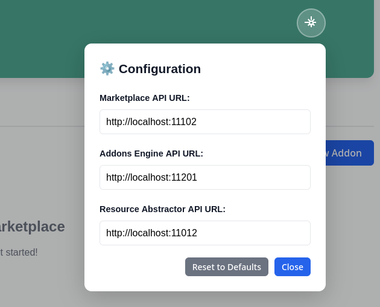

The addons system consists of three subsystems:
- The addons engine
- The addons dashboard
- The addons marketplace

The cluster and root orchestrator each deploy an instance of the:
* Addons engine
* Addons dashboard

While sharing an instance of the addons marketplace, which is deployed at the root.



## Visiting the Dashboard

The addons manager and marketplace both expose API endpoints by which they can be controlled. For a user-firendly experience the addons dashboard is recommended.


Since the release of Conga the addons system provides an intuitive UI in the form of the Dashboard


After starting the orchestrator the dashboard is reachable at (replace localhost with address of hosting machine):

**Root:** [localhost:11103](localhost:11103)  
**Cluster:** [localhost:11203](localhost:11203)



You can find a detailed outline of all the API endpoints at:
```bash
<marketplace-ip>:11102/api/docs
```


### Configuration

The dashboard intefaces with the addons marketplace, addons engine and the resource abstractor. To configure where the dashboard reaches these components use the configuration menu.





| | Root | Cluster |
|:---| :--- | :--- |
| Marktetplace | 11102 | - |
| Addons Engine | 11101 | 11201 |
| Resource Abstractor | 11011 | 11012 |



## Disable the Addons System

To disable the addons system when deploying Oakestra components, you need to export the following *override file* before using the startup command:
```bash
 export OVERRIDE_FILES=override-no-addons.yaml
```
To start a single machine root and cluster orchestrator with the addons engine and the marketplace disabled, you can use:
 ```bash
  export OVERRIDE_FILES=override-no-addons.yaml
  curl -sfL oakestra.io/getstarted.sh | sh - 
  ```

The environment variable `OVERRIDE_FILES` is used at Oakestra startup to customize the services composing the control plane. These files are simple docker compose files integrated into Oakestra via the  [override](https://docs.docker.com/compose/how-tos/multiple-compose-files/merge/) functionality.

