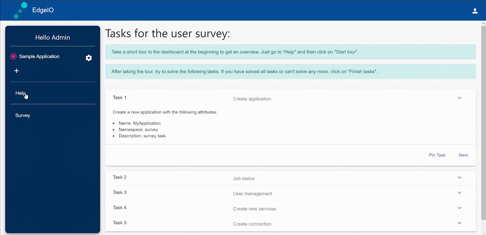
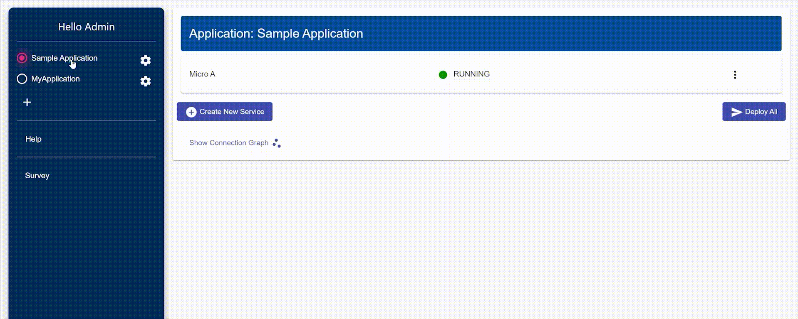
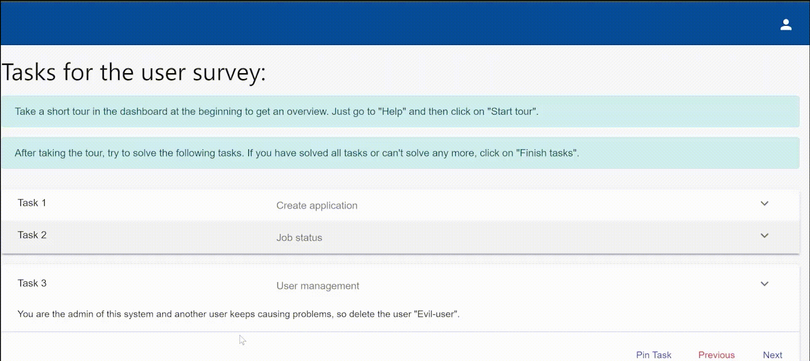
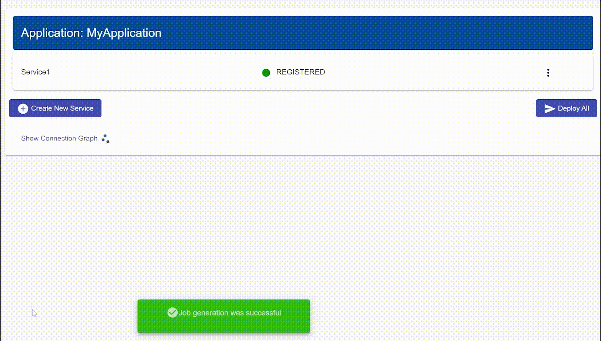

# Features

We have tried to build the dashboard as logically as possible. 
Nevertheless, the most important functions of the dashboard are explained here. 

If you want to have a small overview of the dashboard just start a dashboard tour in the **help section**.

## Login

You can easily log in to the dashboard with your username and password. If you don't have a user account yet, ask the admin to create one for you.

If you forgot your password you can reset it by clicking on the Forgot Password button, you will receive a mail with a link to create a new password. 

## Creating an Application

To create a new application just click on the plus symbol in the application section on the left side. 
Once you have pressed it, a dialog will open where you can specify the name, namespace and description of the application. 

## View Status of a Service

To view the detailed status of a service and read out current data such as CPU and memory consumption, simply click on the status and a dialog opens with the corresponding values. 

## Delete User

To create, edit or delete a user you have to go to the user management page. This page can be found on the top right when you click on the people icon.

In this example an existing user will be deleted.

**Note that the user management page can only be accessed by an admin.**

### Create Service

To create a new service we click on the ``create service`` button. 
We will be redirected to another page where many attributes can be defined. 

In this example only a few attributes are given, in the following you will find a complete list of all attributes with a short description.

**Work in progress. Add description of all attributes**

## Create connections between services

There are several ways to create a connection between two services.

1. A connection can be created in the previously shown input form.

2. A connection can also be created using the connection graph. 
For this we connect two services simply by drag and drop.
A dialog will open where you can specify the requirements for the connection.

This gif shows the creation of a connection with the connection graph:

There are many more functions which are not described here. 
In the future this page will be extended and more functions will be added. 
If you still have difficulties with a function contact the EdgeIO team. 
