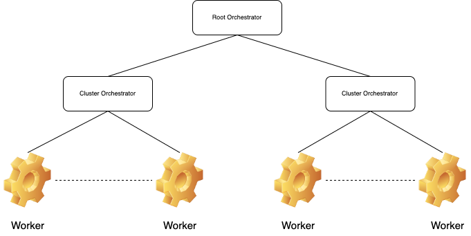

# Get Started with Oakestra


<div style="
	background:#fd0;
	border-radius: 25px;
	margin:5px;
	padding:10px;
	
">

	<span> Oakestra platform is still under active development. This guide can change on a weekly basis. </span>
	
</div>

<div style="
	background:#fd0;
	border-radius: 25px;
	margin:5px;
	padding:10px;
	
">

	<span> <b>Help needed!</b> Feel free to propose your ideas and share your expertise. Thank you in advance!</span>
	
</div>


## High level architecture



Oakestra let you deploy your workload on devices of any size. From a small RasperryPi to a cloud instance far away on GCP or AWS. The tree structure enables you to create multiple clusters of resources.

* The **Root Orchestrator** manages different clusters of resources. The root only sees aggregated cluster resources. 
* The **Cluster orchestrator** manages your worker nodes. This component collects the real time resources and schedules your workloads to the perfect matching device.
* A **Worker** is any device where a component called NodeEngine is installed. Each node can support multiple execution environment such as Containers (containerd runtime), MicroVM (containerd runtime) and Unikernels (mirageOS). 


## Create your first Oakestra cluster

Let's start simple with a single node deployment, where all the components are in the same device. Then, we will separate the components and use multiple devices until we're able to create multiple clusters. 

<div style="
	background:lightgrey;
	border-radius: 25px;
	margin:5px;
	padding:10px;
	
">
	<b>Requirements: <br></b>
	<ul>
		<li> Linux (Workers only)
 		<li> Docker + Docker compose (Orchestrators only)
	</ul>
	
</div>

### 1-DOC (1 Device, One Cluster) 

In this example we are going to use a single device to deploy all the components. This is not recommended for production environments but it is quite cool for home environment and development. 


0) First let's export the required environment variables

```
## Url that points to the location of our root orchestrator
export SYSTEM_MANAGER_URL=0.0.0.0
## Choose a unique name for your cluster
export CLUSTER_NAME=My_Awesome_Cluster
## Come up with a name for the current location
export CLUSTER_LOCATION=My_Awesome_Apartment
```

**1)** now clone the repository and move into it using:

```
$ git clone https://github.com/edgeIO/edgeio.git && cd edgeio
```

**2)** run the root orchestrator:

```
$ sudo -E docker-compose -f root_orchestrator/docker-compose-<arch>.yml up -d
```
( please replace < arch > with your device architecture: **arm** or **amd64** )

**3)** run the cluster orchestrator:

```
$ sudo -E docker-compose -f cluster_orchestrator/docker-compose-<arch>.yml up -d
```
( please replace < arch > with your device architecture: **arm** or **amd64** )

**4)** download and unzip and install the node engine package

```
$ wget -c https://github.com/edgeIO/edgeio/releases/download/NodeEngine-v0.01/GoNodeEngine.zip && unzip GoNodeEngine.zip -d GoNodeEngine && cd GoNodeEngine && ./install.sh <arch>
```
( please replace < arch > with your device architecture: **arm** or **amd64** )

**5)** (optional) download and unzip and install the network manager, this enables an overlay network across your services

```
$ wget -c https://github.com/edgeIO/edgeionet/releases/download/v0.03-experimental/NetManager.zip && unzip GoNodeEngine.zip -d NetManager && cd NetManager && ./install.sh <arch>
```
( please replace < arch > with your device architecture: **arm** or **amd64** )

5.1) Edit `/etc/netmanager/netcfg.json` as follows:

```
{
  "NodePublicAddress": "<IP ADDRESS OF THIS DEVICE>",
  "NodePublicPort": "<PORT REACHABLE FROM OUTSIDE, use 50103 as default>",
  "ClusterUrl": "localhost",
  "ClusterMqttPort": "10003"
}
```
5.2) start the NetManager on port 6000

```
sudo NetManager -p 6000 &
```


**6)** start the NodeEngine

```
sudo NodeEngine -n 6000 -p 10100
```
( you can use `NodeEngine -h` for further details )


### M-DOC (M Devices, One Cluster)
### MDNC (M Devices, N Clusters)
### Hybrids